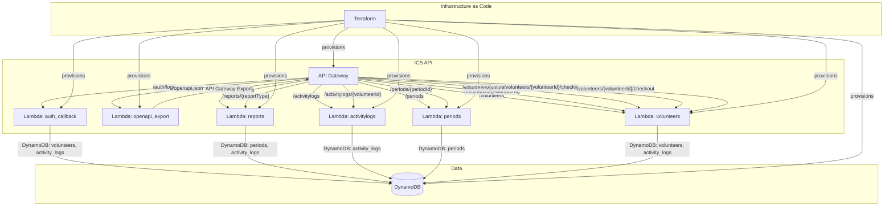

# Incident Command API Architecture (Mermaid)

---

- All Lambda functions are provisioned and connected via Terraform.
- API Gateway routes requests to the appropriate Lambda handler.
- Lambdas interact with DynamoDB tables as needed.
- The OpenAPI export Lambda fetches the API spec from API Gateway.
- CORS and binary media types are configured in API Gateway via Terraform.
